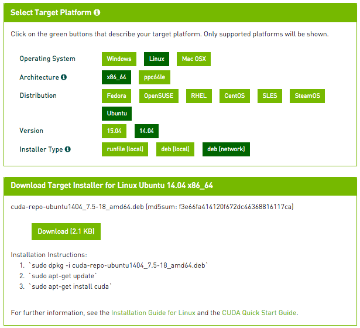
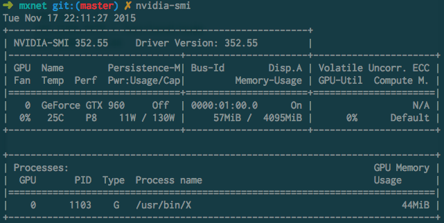

#用MXnet实战深度学习之一：安装GPU版mxnet并跑一个MNIST手写数字识别
我想写一系列深度学习的简单实战教程，用mxnet做实现平台的实例代码简单讲解深度学习常用的一些技术方向和实战样例。这一系列的主要内容偏向于讲解实际的例子，从样例和代码里中学习解决实际问题。我会默认读者有一定神经网络和深度学习的基础知识，读者在这里不会看到大段推导和理论阐述。基础理论知识十分重要，如果读者对理论知识有兴趣，可以参看已有的深度学习教程补充和巩固理论基础，这里<http://deeplearning.net/reading-list/tutorials/>有一些不错的理论教程，相关的理论知识在此不赘述。

##MXnet: 轻量化分布式可移植深度学习计算平台

[MXnet](https://github.com/dmlc/mxnet)是一群聪明勇敢勤劳的年轻计算机科学家实现的开源深度学习计算平台，它是DMLC分布式机器学习通用工具包 <http://dmlc.ml/> 的重要部分（如果你知道xgboost <https://github.com/dmlc/xgboost> 这个并行GBT的实现，应该对DMLC也不会陌生）。MXnet的优点是，轻量化、可移植性高、也可轻松分布式并行，并且高效利用显存，更可以灵活的运行在移动设备上。它的代码和使用方法也简洁明了，适合学习实战。这么有意思的深度学习工具平台，大家快去点这个github连接给它加个星加个fork吧，传送门：<https://github.com/dmlc/mxnet>

##安装MXnet
MXnet支持Linux，Windows和Mac平台。本文使用的主要平台是ubuntu 14.04 LTS。提醒注意，这一些系列教程使用CUDA平台做GPU运算，而在本文写作的时候CUDA暂时还不支持最新的ubuntu 15.10版本的环境和编译器（主要是gcc 5.2的编译器），所以强烈建议坚守14.04 LTS版本或者是最多到15.04版。

安装环境可以是带nVidia显卡的实体机器或者是带GPU的云服务器。如果选择实体机，请不要通过虚拟机安装，比如原生Windows下面跑个虚拟的Linux，因为多数虚拟机软件不支持直接调用本机显卡。如果选择云服务器，请一定选择GPU instance比如AWS的`g2.2xlarge`或`g2.8xlarge`，或者是`terminal.com`的GPU instance。注意：`terminal.com`号称运行时可以改虚拟机的类型，但是纯CPU的虚拟机在运行时不能无缝切换到GPU，建议一开始就选择GPU instance。

以下安装步骤参考于官方文档：<http://mxnt.ml/en/latest/build.html#building-on-linux>，本文根据CUDA的安装和实际操作略有修改。

### 基本依赖的安装
MXnet的另一个优点就是它只需要很少的第三方包，它基本只需要gcc的编译器，BLAS以及可选安装OpenCV。这里如果还没有安装git可以顺道安装一下。

    sudo apt-get update
    sudo apt-get install -y build-essential git libblas-dev libopencv-dev

### 下载mxnet

    git clone --recursive https://github.com/dmlc/mxnet

这里提醒注意一定不要忘记`--recursive`参数，因为mxnet依赖于DMLC通用工具包<http://dmlc.ml/>，`--recursive`参数可以自动加载`mshadow`等依赖。这里暂时不要着急编译，我们还要装一下CUDA。

### 安装CUDA

这里提到的CUDA安装方法也适用于除MXnet之外的其他深度学习软件包。我们通过nVidia官方链接下载安装CUDA驱动和工具包，请前往 <https://developer.nvidia.com/cuda-downloads> 选择对应的安装方式。国内读者建议网络安装方式`deb(network)`，这样ubuntu会选择就近的国内的源安装，速度可能比较快。

如果用ubuntu 14.04，不用去官网，直接运行以下这些命令也可以调用官网下载（安装包较大需要耐心等待）：

    wget http://developer.download.nvidia.com/compute/cuda/repos/ubuntu1404/x86_64/cuda-repo-ubuntu1404_7.5-18_amd64.deb
    sudo dpkg -i cuda-repo-ubuntu1404_7.5-18_amd64.deb
    sudo apt-get update
    sudo apt-get install cuda

如果一切安装成功，可以用`nvidia-smi`命令查看你的显卡使用情况，一般空闲的显卡状态是这个样子的：

显卡型号取决于个人经济能力，不过mxnet的显存利用率高，一般一个4G的显卡就足够处理多数别的工具包要很多显存的问题。

**可选安装**：Mxnet也支持`cuDNN`，它是nVidia推出的深度学习加速工具包，能高效实现一些卷积等深度学习常用操作，在内存使用和计算速度上面能有所提高。大家可以到这里 <https://developer.nvidia.com/cudnn> 申请开发者项目，如果批准通过可以下载安装cuDNN工具包，具体请参照nVidia官方教程。

### 编译支持GPU的MXnet
MXnet需要打开一个编译和链接选项来支持CUDA。在前一步`git clone`得到的`mxnet/`目录里找到`mxnet/make/`子目录，把该目录下的`config.mk`复制到`mxnet/`目录，用文本编辑器打开，找到并修改以下三行：

    USE_CUDA = 1
    USE_CUDA_PATH = /usr/local/cuda
    USE_BLAS = atlas

其中第二行是CUDA的安装目录。如果选择默认安装方式，它会在`/usr/local/cuda`或者是类似`/usr/local/cuda-7.5`这样的原始安装目录，如果是自定义目录的安装，请自行修改本条。这里的`BLAS`使用的是ubuntu的`atlas`实现，也请一并修改。

修改之后，在`mxnet/`目录下编译（`-j4`是可选参数表示用4线程编译）：

    make -j4

注意：如果没有CUDA支持的显卡（比如Intel的Iris显卡或者AMD的R系列显卡）或者没有显卡，安装和编译GPU版本的mxnet会出错。解决方法是，把`USE_CUDA = 1`改回`USE_CUDA = 0`，并确保`USE_OPENMP = 1`，mxnet会自动编译CPU版本并使用OpenMP进行多核CPU计算。根据问题的不同，GPU版本对比CPU版一般会有20-30倍左右的加速。

### 安装Python支持
MXnet支持python调用。简单来说就这么安装：

    cd python; python setup.py install

建议使用python 2.7版本，需要预先安装`setuptools`和`numpy`。如果你的系统安装Numpy有些困难，可以考虑安装[Anaconda](https://www.continuum.io/downloads)或者[Miniconda](http://conda.pydata.org/miniconda.html)之类的python发行版：

    wget https://repo.continuum.io/miniconda/Miniconda-latest-Linux-x86_64.sh
    bash Miniconda-latest-Linux-x86_64.sh
    （确认回答若干安装问题后）
    conda install numpy

## 运行MNIST手写数字识别

当MXnet一切安装好之后，可以试试看一下最简单的例子，MNIST手写数字识别。MNIST数据集包含6万个手写数字的训练数据集以及1万个测试数据集，每个图片是28x28的灰度图。在`mxnet/example/mnist`里可以找到MXnet自带MNIST的识别样例，我们可以先运行一下试试：

    cd mxnet/example/mnist
    python mlp.py

`mlp.py`会自动下载MNIST数据集，在第一次运行的时候耐心等待一下。

**注意**：`mlp.py` 默认使用CPU，训练过程可以跑起来但是很慢。我们已经安装了GPU，只需要修改一行代码，把`FeedForward`调用的CPU部分改成GPU即可让MXnet运行在GPU上：

    model = mx.model.FeedForward(
            ctx = mx.cpu(), symbol = mlp, num_epoch = 20,
            learning_rate = 0.1, momentum = 0.9, wd = 0.00001)   

变成：

    model = mx.model.FeedForward(
            ctx = mx.gpu(), symbol = mlp, num_epoch = 20,
            learning_rate = 0.1, momentum = 0.9, wd = 0.00001)   

再运行一下，是不是快多了呢？MXnet的优点就是接口简洁。

### 可能出现的问题
运行GPU例子的时候可能会遇到这样的问题：

    ImportError: libcudart.so.7.0: cannot open shared object file: No such file 

这是因为没有把CUDA的动态链接库加入PATH里，解决方法是，可以在`./bashrc`里面加入：

    export LD_LIBRARY_PATH=/usr/local/cuda-7.5/targets/x86_64-linux/lib/:$LD_LIBRARY_PATH
    
或者是在编译MXnet的时候，在`config.mk`里的

    ADD_LDFLAGS = -I/usr/local/cuda-7.5/targets/x86_64-linux/lib/
    ADD_CFLAGS =-I/usr/local/cuda-7.5/targets/x86_64-linux/lib/

### MNIST代码简单讲解：设计一个最简单的多层神经网络
`mlp.py`实现的是一个多层感知器网络（multilayer perceptron (MLP) ）或者叫多层神经网络。在MXnet里，实现一个MLP首先需要定义一下这个MLP的结构，比如在代码里一个三层网络的MLP就是这样的：

    data = mx.symbol.Variable('data')
    fc1 = mx.symbol.FullyConnected(data = data, name='fc1', num_hidden=128)
    act1 = mx.symbol.Activation(data = fc1, name='relu1', act_type="relu")
    fc2 = mx.symbol.FullyConnected(data = act1, name = 'fc2', num_hidden = 64)
    act2 = mx.symbol.Activation(data = fc2, name='relu2', act_type="relu")
    fc3 = mx.symbol.FullyConnected(data = act2, name='fc3', num_hidden=10)
    mlp = mx.symbol.Softmax(data = fc3, name = 'mlp')

简单解释一下这几行代码：MLP的每一层需要定义这一层节点的样式，比如`fc1`就是接受输入的第一层，它定义为一个全链接层`mx.symbol.FullyConnected`，通过`data`接受输入，这一层包含了128个节点（`num_hidden`）。每一层也需要定义激活函数`Activation`，比如第一层到第二层之间的激活函数就是`relu`（代表rectified linear unit或者叫`Rectifier`）ReLu是深度神经网络里最常见的一个激活函数，主要因为计算函数相对容易和梯度下降不会发散。限于这里篇幅主要是为了介绍实现一个网络，关于ReLU的相关背景知识请参考[wikipedia](https://en.wikipedia.org/wiki/Rectifier_(neural_networks) )和其他相关教程。第二层网络`fc2`和第一层相似，它接受`fc1`的数据作为输入，输出给第三层。第三层网络`fc3`和前两层类似，不一样的是它是个结果输出层，产生的是输入图片对应于0-9总共10个数字里每个数字的概率，所以它的`num_hidden=10`。

设计好了网络结构之后，MXnet需要声明输入，因为每个图片都是28x28大小展开成一列向量就是784维，我们可以告诉mxnet数据的输入尺寸是784，`mnist_iterator`是一个python generator一次提供100组数据给我们刚刚设计的MLP：

    train, val = mnist_iterator(batch_size=100, input_shape = (784,))

接下来就让MXnet建立并运行这个一个模型，就是这样简单，如果你会`scikit-learn`会感到很亲切，对不对（记得刚刚修改的指定GPU运行的那一行么？）：

    model = mx.model.FeedForward(
            ctx = mx.gpu(), symbol = mlp, num_epoch = 20,
            learning_rate = 0.1, momentum = 0.9, wd = 0.00001)   
    model.fit(X=train, eval_data=val)

到这里，大家就基本会实现一个多层感知器MLP，恭喜你们这是掌握深度学习的第一步。MXnet的方式比Caffe等其他工具要写个配置文件简单的多了。工业界和学术界的多数深度学习的实际问题都是围绕着设计多层感知器展开，在结构设计激活函数设计等方面有很多有意思的问题。

有读者会问，MLP是不是非要像MNIST手写数字识别这么设计。不是的，这个三层网络只是一个最简单的MLP的例子，这里每一层并不一定需要这样。设计一个更好更高效的多层神经网络和艺术一样没有止境。比如在MNIST同一个目录下的`lenet.py`就是用Yann Lecun设计的卷积网络实现数字识别，每层网络需要做的是`Convolution` `Activation`和`Pooling`（如果想知道这三个具体是什么，请参看他的[深度学习教程](http://www.cs.nyu.edu/~yann/talks/lecun-ranzato-icml2013.pdf)，以后的文章里面可能也会提到。

当做课后作业，读者可以自己试试调一下`mlp.py`里不同的节点数和激活函数看看对数字识别率有什么提升，也可以增加`num_epoch`调整`learning_rate `等参数，在转发、评论或留言写下你们的设计方法和识别准确度（并没有奖励，嗯）。Kaggle针对MNIST数据集有一个教学比赛，读者可以用MXnet训练一个自己的MNIST模型，把结果提交上去比一比，记得说你是用MXnet做的哟，传送门： <https://www.kaggle.com/c/digit-recognizer>

## 后记
这篇文章是这一系列的第一篇，我本意是想写个MXnet的GPU安装方法，后来想想加个例子讲解一下各种模型顺便当做另外一种深度学习入门教程吧。后续的一些文章会挑选mxnet自带的例子，介绍一些常见的有意思的深度学习模型，比如RNN，LSTM，以及它们在MXnet里的实现，比如写个自动作词机模仿汪峰老师作词之类的。MXnet这么有意思的深度学习工具平台，大家快去这个github连接给它加个星加个fork吧，传送门：<https://github.com/dmlc/mxnet>
    
